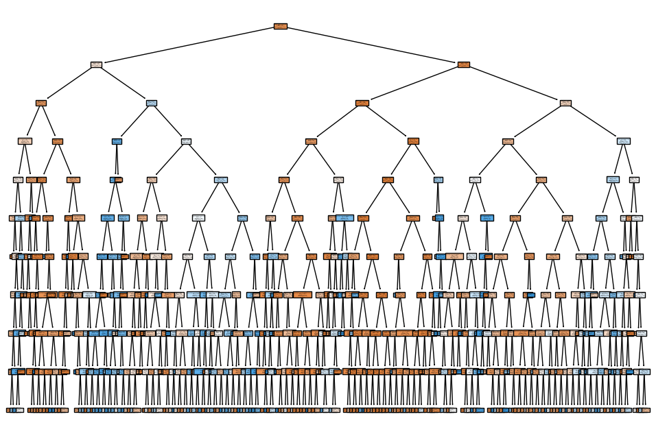

# 🧠 Task 3 – Decision Tree Classifier: Bank Marketing Dataset

## 🎯 Objective

Develop a machine learning model to **predict whether a customer will subscribe to a term deposit**, using demographic and behavioral data from a real-world marketing campaign.

---

## 📁 Dataset Overview

- **Source:** [UCI Machine Learning Repository – Bank Marketing Dataset](https://archive.ics.uci.edu/ml/datasets/Bank+Marketing)
- **Records:** ~45,000
- **Format:** Tabular, CSV
- **Features Include:**
  - Demographics: Age, Job, Marital Status, Education
  - Contact Details: Contact Type, Last Contact Month, Duration
  - Campaign Info: Number of Contacts, Previous Outcome
  - Other Attributes: Default status, Housing loan, Personal loan

---

## 🔍 Features Used in Modeling

The model uses a mix of **categorical and numerical attributes**, including:

- `age`, `job`, `marital`, `education`
- `contact`, `month`, `duration`, `campaign`, `poutcome`
- Plus engineered features based on campaign interaction behavior

All categorical features were **one-hot encoded** before training.

---

## 🧠 Model Summary

- **Algorithm:** Decision Tree Classifier  
- **Library:** `scikit-learn`  
- **Data Split:** 80% training / 20% testing  
- **Preprocessing:** One-hot encoding  
- **Hyperparameters:**
  - `max_depth=5`
  - `random_state=42`

---

## 🔎 Analysis

- The model **performs well** in identifying customers who **did not subscribe** (Class 0) with **very high precision and recall**.
- Performance is **weaker** on predicting customers who **did subscribe** (Class 1), particularly in **recall (33%)**, indicating many positive cases are missed.
- This issue is **common in imbalanced classification tasks** where the "Yes" class is significantly smaller.

---

## 🛠️ Recommendations for Improvement

- Apply **class balancing techniques**:
  - **SMOTE** (Synthetic Minority Oversampling Technique)
  - **Class weighting** in the model
- Try **alternative models**:
  - Random Forest
  - Gradient Boosting (e.g., XGBoost, LightGBM)
- Use **GridSearchCV** for deeper hyperparameter tuning

---

## 📈 Visualizations Included

- **Decision Tree Plot**: Visual representation of feature splits  
- **Class Distribution**: Pre- and post-model analysis  
- **Performance Charts**: Bar plots, confusion matrix heatmap
 
---

## 🧰 Tools & Libraries Used

- `Python`
- `pandas` – Data manipulation  
- `scikit-learn` – Modeling & evaluation  
- `matplotlib`, `seaborn` – Visualizations  
- `Jupyter Notebook` – Interactive development

---

## 📂 Files in This Repository

| File Name                         | Description                                  |
|----------------------------------|----------------------------------------------|
| `Bank Marketing Decision Tree.ipynb` | Jupyter Notebook with full code & analysis  |
| `bank-full.csv` *(external)*     | Dataset (Download separately due to size)    |

> 📌 **Note**: The dataset is not included in this repo due to size. Please download it directly from the [UCI Repository](https://archive.ics.uci.edu/ml/datasets/Bank+Marketing).

---

### 🚀 This project demonstrates how simple decision trees can still yield valuable insights for binary classification tasks, while highlighting the importance of addressing dataset imbalance.

